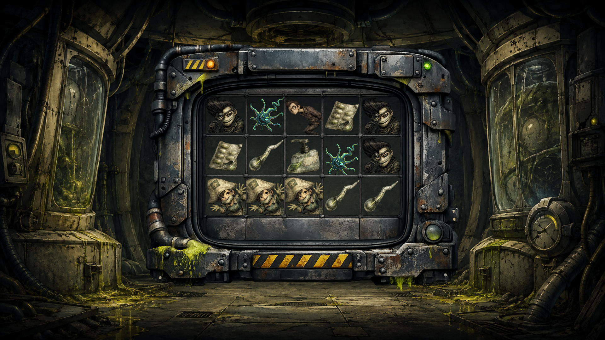

# Spread

*Spread* is an actively developed slot game prototype built in TypeScript. The project combines a deterministic gameplay domain, fixed-payline evaluation, simulation tooling, and an evolving graphical presentation shaped around a contaminated psychological dark-comedy setting.

This repository documents the game from early rules and architecture through asset production and first playable graphics. It is a work in progress, not a finished or commercially released game.

## Project Overview

The current game uses a five-reel, three-row layout with weighted symbol generation, left-to-right payline wins, Wild substitution, payout calculation, and complete spin orchestration. The implementation keeps gameplay rules separate from presentation so the engine can be tested and simulated while the interface continues to evolve.

The central mechanic is infection: naturally generated Virus Wild symbols inspect their directly adjacent cells after the reels stop and transform eligible human symbols into Infected Wilds. The transformation resolves before paylines are evaluated, and newly infected Wilds do not create chain reactions in the current prototype.

## Current Status

*Spread* is currently in the **first graphical prototype phase**. The initial graphical foundation is available for production validation, while the interface and playable presentation remain under active development.

- Artwork is prototype quality and may be revised or replaced.
- UI production is active, with HUD and controls still to be developed.
- Gameplay systems, balancing, and presentation behavior are still evolving.
- Animation, effects, and broader visual polish are planned for later production.

Nothing currently shown should be interpreted as final artwork or final game presentation.

## First Graphical Prototype



This work-in-progress composition brings together the prototype background, Reel Frame, symbol set, and first 5×3 layout validation. It is intended to evaluate scale, spacing, readability, hierarchy, and asset compatibility during production—not to serve as marketing material or represent final visual quality.

## Roadmap

### Prototype milestones reached

- ✅ Core Gameplay Architecture
- ✅ Symbol Production
- ✅ Environment Production
- ✅ Reel Frame
- ✅ First Graphical Prototype Foundation

These milestones indicate that a usable prototype foundation exists. They do not lock the underlying systems or artwork against future revision.

### Current

- 🚧 UI Production

### Upcoming

- HUD
- Spin Button
- Logo
- Interactive Prototype
- Animations
- Visual Polish

Detailed production planning is maintained in the [V1 Production Roadmap](docs/roadmap/v1-production-roadmap.md) and [V2 Production Roadmap](docs/roadmap/v2-production-roadmap.md).

## Gameplay Foundation

The current TypeScript domain includes:

- a five-column by three-row game grid;
- weighted symbol generation;
- the infection transformation;
- fixed-payline evaluation;
- Wild substitution;
- payout and total-win calculation;
- complete spin orchestration; and
- large-sample simulation for provisional balancing.

The engine and terminal tools validate gameplay independently from the graphical prototype. Graphical interaction is an upcoming production step.

## Running the Project Tools

Install the development dependencies:

```bash
npm install
```

Run one complete base-game spin:

```bash
npm run demo
```

The terminal demonstration prints the initial grid, infection summary, final grid, winning paylines, and total multiplier.

Run the default 1,000,000-spin simulation:

```bash
npm run simulate
```

Provide a custom positive spin count after `--`:

```bash
npm run simulate -- 100000
```

Run automated tests and TypeScript checks:

```bash
npm test
npm run typecheck
```

Simulation output is a provisional design aid rather than regulatory-grade validation. Results vary between samples, and payout distribution, volatility, symbol weights, and paytable values remain subject to tuning.

## Documentation

- [V1 project documentation](docs/v1/)
- [Gameplay mechanics](docs/mechanics/)
- [Game architecture](docs/architecture/game-arhitecture.md)
- [Design documentation](docs/design/)
- [Reel Grid layout specification](docs/design/layout/reel-grid-spec.md)
- [UI visual language](docs/design/ui/ui-visual-language.md)
- [Production roadmaps](docs/roadmap/)

## Development Direction

The immediate focus is completing the prototype UI around the gameplay-first reel layout, then connecting the graphical presentation to the existing spin systems. Later work will cover animation, feedback, effects, balancing, accessibility, and visual refinement after the interactive foundation has been validated.
